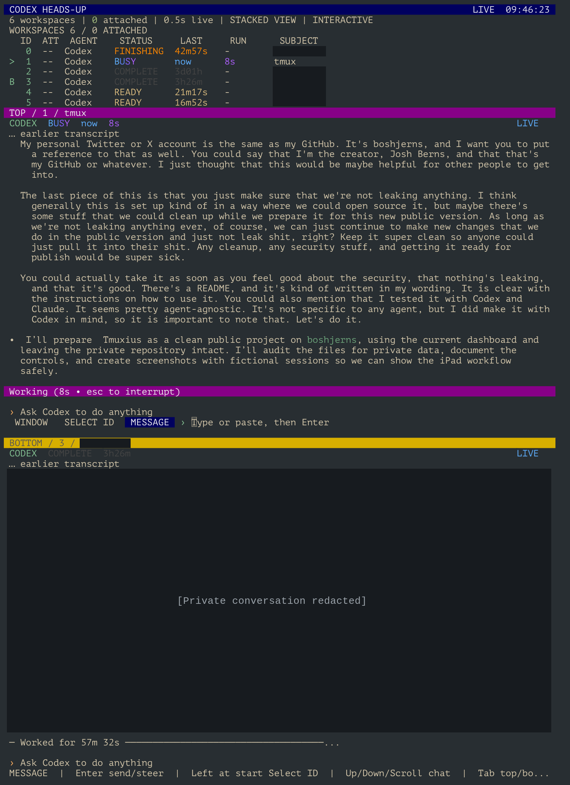

# Tmuxius

**A compact dashboard for agents working in tmux. Built around an iPad Mini workflow.**

See multiple agents, keep their subjects visible, scroll through their context,
and send a message when you need to. Runs in your terminal over SSH, with one
full-height conversation or two stacked conversations.



*A real screenshot from my iPad workflow. The header shows the earlier
"CODEX HEADS-UP" name. Unrelated session subjects and the lower conversation
are covered for privacy; device chrome and image metadata are removed.
The visible interface and conversation are unchanged.*

## Why I made this

I mainly use agents in tmux, and I use it on an iPad Mini. It's very important to
me that I can see the full context of multiple agents as they're working and
easily swipe between different windows and contexts.

I want to move through the windows, scroll, and keep an eye on everything without
having to do anything other than swiping until it comes time to actually type
something. The hotkeys and accessible controls matter just as much: I want as
much of the workspace back as possible while keeping all of the tooling.

This became useful enough that I thought other people might want it too, so I'm
putting it out here. I made it with Codex in mind and have tested it with Codex
and Claude. The idea is agent-agnostic: use whatever you like in tmux.

— **Josh Berns**, [@boshjerns on GitHub](https://github.com/boshjerns) and
[@boshjerns on X](https://x.com/boshjerns)

## What it does

- One conversation or two stacked panels, with separate scroll positions and drafts.
- A workspace list with session IDs, agent names, activity hints, and subjects.
- Purple **TOP** and amber **BOTTOM** identifiers that keep their colors when
  focus changes. Working, elapsed-time, and background-terminal rows match.
- Borderless panels and a single control row on the selected panel. Press **C**
  in a control mode to hide the workspace list and reclaim its space.
- Arrow keys, numeric selection, mouse/scroll input, and bracketed paste.
- Explicit message submission to recognized Codex and Claude composers, including
  steering a busy agent, with checks against overwriting an existing draft.

Viewing works with other terminal programs too. **Verified message sending
currently supports recognized Codex and Claude composer layouts.** Other agent
interfaces, permission dialogs, and full terminal interaction belong in the
original tmux pane. Tmuxius is an independent project, unaffiliated with OpenAI
or Anthropic.

## Install and run

On the **host running tmux**, install Python **3.10+** with curses and tmux.
Linux is the tested host platform; the tablet is the SSH client. The dashboard
uses only Python's standard library. A 256-color terminal is recommended.

```sh
# Debian / Ubuntu host
sudo apt-get install python3 tmux

git clone https://github.com/boshjerns/Tmuxius.git
cd Tmuxius
./install.sh
export PATH="$HOME/.local/bin:$PATH"
tmuxius
```

The installer defaults to `~/.local`. It installs the command and its bundled
message helper; it does not edit shell startup files, agent settings, or tmux
configuration. Add the PATH line to your shell configuration if needed.
For a different location, use `PREFIX=/your/prefix ./install.sh`.

### Optional tmux configuration: on and off

**No special Codex or tmux configuration is required for keyboard operation.**
Tmuxius does not disable agent animations or throttle the original terminal.
Its own selected-panel refresh defaults to twice per second, including changing
Working timers; unchanged frames reuse cached parsing to keep scrolling light.
That interval controls how often Tmuxius reads the pane. The agent must also
redraw its timer: disabling Codex's `tui.animations` can leave Working unchanged
until another event occurs. Restore Codex's default animations and restart the
Codex process itself if you previously disabled them; reopening only Tmuxius
does not reload Codex's configuration.

If you run it inside a separate tmux session called `monitor`, you can optionally
enable mouse support for just that session, then restore its exact prior setting:

```sh
tmux new-session -d -s monitor tmuxius
tmuxius-mouse on --target monitor
tmux attach-session -t monitor

# From another shell, or after detaching:
tmuxius-mouse status --target monitor
tmuxius-mouse off --target monitor
```

The toggle changes one session's `mouse` option and saves the previous value in
a session option. Repeated `on` is safe; `off` restores the saved value or
inheritance. It does not change global defaults or write to `~/.tmux.conf`.
An existing global mouse setting remains yours. Add `--socket /path/to/socket`
to the toggle when using a different server. The saved setting lasts for the
session's lifetime. Native tmux status-bar theming is separate and optional;
Tmuxius leaves it alone.

You can also run directly from the checkout with `./tmuxius`. Start it in a
separate terminal or a separate tmux session so your agent's pane stays visible.
Each workspace represents a tmux **session's active pane**; it is not a list of
every pane in every session.

Try the controls with fictional conversations and no connection to your sessions:

```sh
python3 examples/demo.py
```

To create a simple two-agent setup (with the agents installed separately):

```sh
tmux new-session -d -s 0 -n 'Build the app' codex
tmux new-session -d -s 1 -n 'Write the docs' claude
tmux set-window-option -t 0:0 automatic-rename off
tmux set-window-option -t 1:0 automatic-rename off
tmuxius
```

## Start here

The dashboard opens in **Message** mode. Press **Esc** to reach **Select ID**,
then **S** for two stacked panels. Use **Tab** to switch top/bottom, arrow keys
to choose a workspace, and **Right** to return to Message.

| Control | Action |
| --- | --- |
| **Esc** | Leave Message for Select ID; your draft stays with that workspace |
| **Left / Right** outside Message | Move through Window → Select ID → Message |
| **Up / Down** or scroll in Window | Select the top or bottom panel |
| **Up / Down** or scroll in Select ID | Change the active panel's workspace |
| **Digits** in Select ID | Choose a numeric session name; Enter confirms immediately |
| **Up / Down**, scroll, **Page Up / Page Down** in Message | Scroll conversation history |
| **Tab / Shift-Tab** in stacked view | Switch the active top/bottom panel |
| **C** outside Message | Collapse or restore the workspace list |
| **S** outside Message | Switch one-panel / stacked view |
| **R** or **Ctrl-L** outside Message | Refresh |
| **Q** outside Message | Quit the dashboard |
| **Enter** in Message | Submit the message you typed or pasted |

These letter shortcuts are case-insensitive. **In Message, C, S, R, and Q type
ordinary text.** Only the selected panel shows the control/composer row, and the
highlighted mode chip tells you what the arrows will do.

**On iPad:** use your SSH terminal's mouse/scroll reporting and gesture mappings.
Swipes work when the terminal translates them into scroll or arrow-key events;
Tmuxius does not receive raw touch gestures. If a swipe scrolls the terminal
app's own history, adjust that app's gesture mode. The arrow keys remain a
complete navigation path. See the [navigation guide](docs/navigation.md) for
editing, mouse behavior, subject names, scrollback, and troubleshooting.

## Options

```sh
tmuxius --summary                  # Print a summary and exit
tmuxius --socket /path/to/socket   # Choose an existing tmux server
tmuxius --interval 1               # Selected-panel refresh, in seconds
tmuxius --history-lines 10000      # Limit captured history per selected pane
tmuxius --no-color                 # Also respects NO_COLOR
tmuxius --version
tmuxius --self-test
```

By default, selected panels refresh every 0.5 seconds and retain all history
still available in tmux. Metadata refreshes less frequently. The dashboard does
not resize the monitored panes. Minimum size: 52 columns × 10 rows, or 52 × 16
for stacked view. More rows make reading much more comfortable.

## Privacy and contributing

Tmuxius makes no network requests and has no telemetry or hosted service. It
reads local tmux output and, for Codex subject enrichment on Linux, local process
metadata and Codex's SQLite thread metadata. Messages you explicitly submit are
handled by the selected agent and its own provider settings.

**Your live dashboard can contain private terminal content.** Conversation
panels do not redact secrets. Use the fictional demo when reporting UI issues,
or review and redact a real screenshot before sharing it. Read
[SECURITY.md](SECURITY.md) for the trust model and [CONTRIBUTING.md](CONTRIBUTING.md)
for tests and publication checks.

MIT licensed. Contributions for other agent interfaces and terminal clients are
welcome, especially with small, synthetic reproductions.
